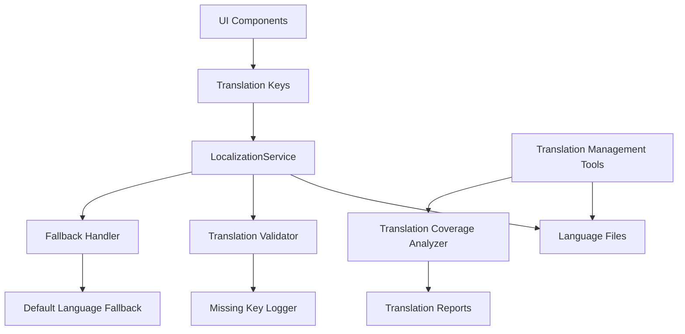

# Design Document

## Overview

The comprehensive text translation system will build upon the existing localization infrastructure in the NisaRide Flutter application. The current system uses GetX for internationalization with support for multiple languages, but this implementation will focus specifically on English (en) and Urdu (ur) languages only. The design focuses on identifying and translating all remaining hardcoded text, improving translation quality, implementing missing translations, and ensuring comprehensive coverage across all application screens for these two languages.

## Architecture

### Current Localization Infrastructure

The application already has a solid foundation:
- **LocalizationService**: Extends GetX Translations class and manages language switching
- **Language Files**: Separate files for English (app_en.dart) and Urdu (app_ur.dart)
- **GetX Integration**: Uses `.tr` extension for translation lookup
- **Language Persistence**: LanguageUtils handles saving and loading language preferences
- **Existing Support**: Arabic and French files exist but will not be maintained in this implementation

### Enhanced Architecture Components



## Components and Interfaces

### 1. Translation Coverage Analyzer

**Purpose**: Scan the codebase to identify hardcoded strings and missing translations

**Interface**:
```dart
class TranslationCoverageAnalyzer {
  Future<CoverageReport> analyzeCodebase();
  List<String> findHardcodedStrings(String filePath);
  Map<String, List<String>> findMissingTranslations();
  void generateCoverageReport();
}
```

### 2. Enhanced LocalizationService

**Purpose**: Extend current service with validation and fallback mechanisms

**Interface**:
```dart
class EnhancedLocalizationService extends LocalizationService {
  String getTranslationWithFallback(String key);
  void logMissingTranslation(String key);
  bool validateTranslationCompleteness();
  void preloadTranslations();
}
```

### 3. Translation Validator

**Purpose**: Ensure translation quality and consistency

**Interface**:
```dart
class TranslationValidator {
  bool validateTranslation(String key, String translation, String language);
  List<ValidationIssue> checkConsistency();
  bool validateRTLSupport(String text);
  void validateCurrencyFormatting();
}
```

### 4. Translation Management Tools

**Purpose**: Developer tools for managing translations efficiently

**Interface**:
```dart
class TranslationManager {
  void addTranslationKey(String key, Map<String, String> translations);
  void updateTranslation(String key, String language, String translation);
  void removeObsoleteKeys();
  void exportTranslations(String format);
  void importTranslations(String filePath);
}
```

## Data Models

### Translation Key Structure

```dart
class TranslationKey {
  final String key;
  final String category;
  final String context;
  final Map<String, String> translations;
  final bool isRequired;
  final DateTime lastUpdated;
}
```

### Coverage Report Model

```dart
class CoverageReport {
  final int totalKeys;
  final Map<String, int> translationCounts;
  final List<String> missingKeys;
  final List<String> hardcodedStrings;
  final double completionPercentage;
  final DateTime generatedAt;
}
```

### Validation Issue Model

```dart
class ValidationIssue {
  final String key;
  final String language;
  final IssueType type;
  final String description;
  final String suggestion;
}

enum IssueType {
  missingTranslation,
  inconsistentTerminology,
  rtlLayoutIssue,
  formattingError,
  contextualMismatch
}
```

## Error Handling

### Missing Translation Handling

1. **Fallback Chain**: 
   - Primary language → English → Key display with warning
   - Log missing translations for developer attention
   - Display clear indicators in debug mode

2. **Runtime Error Prevention**:
   - Null safety for translation lookups
   - Graceful degradation for malformed keys
   - Performance optimization for large translation sets

### Translation Loading Errors

1. **File Loading Issues**:
   - Retry mechanism for network-based translations
   - Local cache fallback
   - Error reporting to analytics

2. **Memory Management**:
   - Lazy loading for large translation sets
   - Memory-efficient caching strategies
   - Cleanup of unused translations

## Testing Strategy

### Unit Testing

1. **Translation Service Tests**:
   - Test translation key lookup
   - Validate fallback mechanisms
   - Test language switching functionality
   - Verify translation caching

2. **Validation Tests**:
   - Test translation completeness checks
   - Validate RTL text handling
   - Test currency and date formatting
   - Verify consistency checks

### Integration Testing

1. **UI Translation Tests**:
   - Test all screens in each language
   - Verify text direction changes
   - Test dynamic language switching
   - Validate layout adjustments for different text lengths

2. **Performance Tests**:
   - Measure translation lookup performance
   - Test memory usage with multiple languages
   - Validate app startup time with translations
   - Test language switching response time

### Automated Testing

1. **Translation Coverage Tests**:
   - Automated scanning for hardcoded strings
   - Missing translation detection
   - Translation key usage validation
   - Obsolete key identification

2. **Quality Assurance Tests**:
   - Automated translation consistency checks
   - RTL layout validation
   - Text overflow detection
   - Font rendering verification

## Implementation Phases

### Phase 1: Analysis and Foundation
- Implement translation coverage analyzer
- Scan codebase for hardcoded strings
- Generate comprehensive coverage report
- Identify missing translations across all languages

### Phase 2: Core Translation Implementation
- Replace all hardcoded strings with translation keys
- Complete missing translations for all supported languages
- Implement enhanced fallback mechanisms
- Add translation validation tools

### Phase 3: Quality and Consistency
- Implement translation validator
- Ensure terminology consistency
- Optimize RTL language support
- Validate currency and date formatting

### Phase 4: Developer Tools and Maintenance
- Create translation management tools
- Implement automated coverage monitoring
- Add developer debugging tools
- Create translation maintenance workflows

## Performance Considerations

### Memory Optimization
- Lazy loading of translation files
- Efficient caching strategies
- Memory cleanup for unused languages
- Optimized data structures for fast lookup

### Runtime Performance
- Pre-compilation of frequently used translations
- Efficient key lookup algorithms
- Minimal overhead for translation calls
- Optimized language switching

### Storage Optimization
- Compressed translation files
- Incremental translation updates
- Efficient file organization
- Minimal app size impact

## Accessibility and Internationalization

### RTL Language Support
- Proper text direction handling for Arabic and Urdu
- Layout mirroring for RTL languages
- Icon and image orientation adjustments
- Input field alignment corrections

### Cultural Considerations
- Appropriate date and time formats
- Currency display conventions
- Number formatting standards
- Cultural color and symbol meanings

### Font and Typography
- Proper font selection for each language
- Character encoding support
- Text rendering optimization
- Font fallback mechanisms